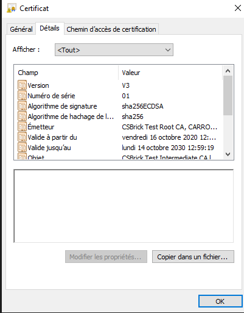

# Chiffrement
Ce dossier comprends quelques algorithme de chiffrement classique
Ainsi que des programmes de cryptoanalyse

# La méthode symétrique 

La méthode symétrique est la plus simple elle consite à fermer le message dans un coffre qui possède une clef. (Clef unique).
On peut ouvrir et fermer à volonté le coffre avec cette simple clef.
Cependant ceci n'est pas très sécurisé car l'enjeux est de communiquer la clef de façon sécurisé. Si la clef est intercepté alors le chiffrement est corrompue.

# La méthode asymétrique "Diffie-Hellman"

Créer en 1976, la méthode asymétrique permet un échange entre deux acteurs sans que ces deux n'est préalablement échangé des clefs.
Il y a ici notion de clef privée et de clef publique respectivement avec les extensions (.pem & .der)
Chacun possède son propre trousseau de clef. (Qui comporte les deux clées liés mathematiquement).

On peut faire une analogie, en comparant la clef publique à un cadenas ouvert.

Lors d'un échange asymétrique si Bob souhaites communiquer un message à Alice.

- Bob donne à Alice sa clef publique (cadenas ouvert).
- Alice reçoit cette clef met son message dans une boite et ferme le coffre avec la clef publique de Bob. (le cadenas ouvert)
(Une fois cette opération effectuée alice n'est pas en mesure de déchiffrer le message qu'elle a elle même écrite).
- Bob reçoit son message dans un coffre fermé avec son cadenas et il est en mesure d'ouvrir le message avec sa clef privée.

Cependant il existe une faille à cette méthode. (Man In the Middle MITM)

Si lors de l'échange, 
- Lorsque Bob envoi sa clef publique à Alice, si cette dernière est intercepté par un homme du milieu.
- L'homme du milieu peut envoyer sa propre clef (cadenas ouvert) à Alice. 
- Alice chiffre le message avec la clef de l'homme du milieu.
- Alice envoi le message à Bob qui est intercepté par l'homme du milieu.
- Le message est récupéré par l'homme du milieu, qui peut ouvrir le message en déchiffrant avec sa propre clef privée. 
- L'homme du milieu peut ainsi modifier le message afin de le réenvoyer à Alice sans que Alice ne s'en rende compte.
- Alice dechiffre ainsi le message falsifié ou non par le pirate avec sa clef privée.

Ainsi pour sécuriser la communication on rajoute d'autres couches de sécurité en particulier les certificats.

# Le chiffrement asymétrique RSA 

Le nom RSA via de la première lettre du nom de ses inventeurs : Ronard Rivest, Adi Shamir, Leonard Adleman
Est un algorithme de cryptographie asymétrique avec paire de clef publique et privée.

# Les certificats

Pour améliorer la sécurité on va faire appel à un intervenant extérieur : appelée organisme ou autorité de certification, en autre une personne en qui tout le monde peut avoir confiance.

Pour commencer :
- Bob demande alors de faire certifier son cadenas (ou clef publique) en justifiant de son identité. 
- A la suite de celà Bob reçoit un certificat associé à sa clef publique qui justifie que la clef publique lui appartient bien.
(Au passage le MITM a aucun interet de faire un certificat avec la clef publique de Bob puisse qu'il ne dispose pas de la clef privée)
- L'interêt des certificats est de les distribuer en l'occurence à Alice.
- Alice doit faire le choix de faire confiance ou pas au certificat de Bob qui le classe ou non dans ses dossiers de confiances.
- En cas de doute Alice peut décider de rejeter le certificat.
- Ainsi lorsque Bob donne sa clef publique, Alice sait qu'il s'agit bien de la clef publique de Bob et non pas d'un homme du milieu.
(Ceci permet de confirmer la bonne identité de son correspondant)
- Ceci permet à Alice de chiffrer le donnée avec la clef publique de Bob et ainsi Bob peut ainsi lire le message d'Alice sans problème de sécurité.

## Format des certificats 

Les certificats ont deux extensions à connaitre :
- Fichier `*.pem` pour les clefs privés (Format Base64 ASCII) A NE PAS DIFFUSER.
- Fichier `*.der` souvent pour les certificats qui inclus sa clef publique (Format Binaire).

## Les certificats autosignés

Ils ne passent pas par l'autorité de certification, c'est donc au destinataire de juger s'il sont de confiance ou pas.
Ils sont autosigné par l'emetteur lui même.

## Les certificats X509

Les certicats X509 est une norme qui défini ce que l'on doit trouver dans un certificat :
A savoir :
- Version
- Numéro de série
- Algorithme de signature : Type de fonction, nombre de bits ...
- Emetteur : Autorité de certification qui a émis ce certificat (CA).
- Valide à partir de : la date de début
- Valide jusqu'à : la date de fin
- Objet : Nm du détenteur de la clef publique- Clé publique : Paramètre de la clef
- ...

# Le PKI

Le Public Key Infrastructure est un système de gestion des clefs permet de classer les certificats qui sont jugés de confiance.
Est un dossier qui regroupe tout les certificats dans plusieurs dossiers :
- Own (ou se trouve ses propres certificats).
- Trusted (Ou se trouve les certificats des intervenants extérieurs).
- Rejected (Les certificats rejetés par défaut).
