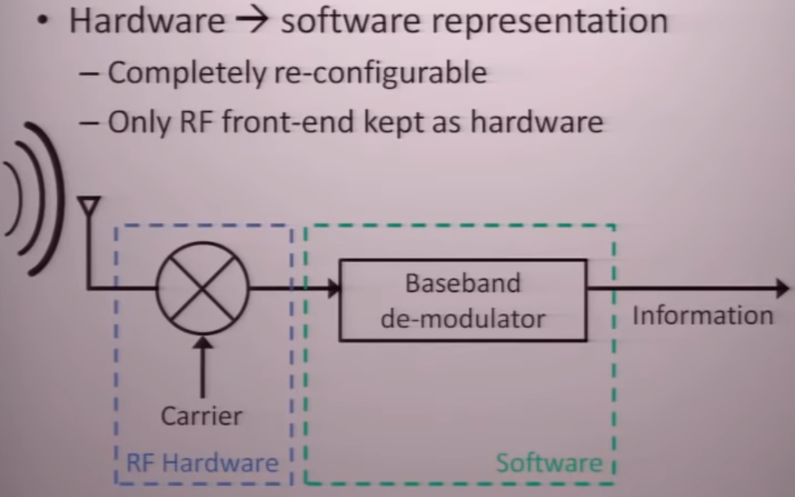
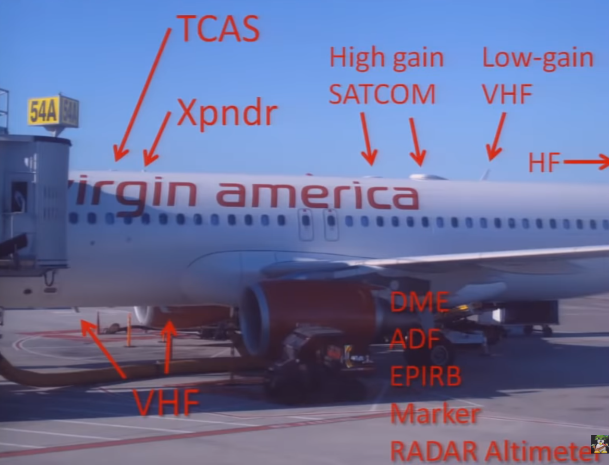
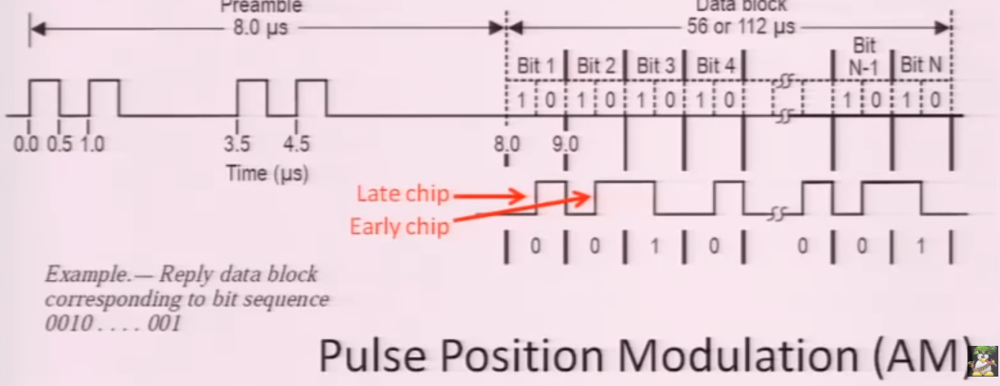

# SDR
SDR est l'acronyme de Software Defined Radio. Est une technologie qui permet par l'intermédiaire logiciel de démoduler/ décoder l'information sans utiliser de circuit électroniques supplémentaires.

Le but est de numériser et de traiter le signal derrière.

## Hardware (Requirement)

FPGA / USRP 1 / FUNcube Dongle / USB DVB-T «ezcap » / LimeSDR / HackRF / BladeRF.

## Logiciels SDR
### Windows
Exemple d'un logiciel SDR sous Windows qui permet d'écouter sur des bandes de fréquences :

### Linux

GQRX

## Tableaux des fréquences ANFR en France :
https://www.anfr.fr/fileadmin/mediatheque/documents/tnrbf/TNRBF_2020-03-16.pdf

Le signal doit être modulé pour transporter l'information 

Notions :
Modulante & Modulée.

### Les types de modulations
#### Modulation Analogique
AM (Amplitude Modulation): possède un spectre long et droit.
FM (Frequency Modulation) : Changement en fréquence sur une bande de fréquence
NFM (Narrowband frequency modulate signal)
PM
QAM
SM
SSB
#### Modulation Numérique
ASK : Amplitude Shift Keying
APSK
CPM
FSK : Frequency Shift Keying
MFSK
MSK
OOK (On-Off Keyying) : Presence ou absence du signal : exemple le morse.
PPM
PSK : Phase Shift Keying
QAM
SC-FDE
TCM
WDM

#### Autre modulation
OFDM : Orthogonal Frequency Division Multiplexing
COFDM : Coded Orthogonal Frequency Division Multiplexing. (Wifi, 4G, ADSL ...)
FBMC : Filter Bank Multicarrier

## Domaines d'applications :
### Aviation
ADS-B en lien avec le sol module ATC.

Pour éviter les collisions:
ATCRBS : Air Traffic Control Radar Beacon System
- Radar primaire : (PSR : Primary Surveillance Radar) La plus grande partie
	Radar traditionnel: “Paint skins” et écoute le retour
	Identifie et traque les cibles pendant qu’elle ignore le “Ground Clutter”
	Portée limitée par l’équation du radar : 1/D⁴
-Secondary Surveillance Radar
	Radar directionnel
	Besoin d’un transpondeur
	Intérroge les transpondeurs qui répondent avec leurs IDS, Altitude etc …
	Une sorte de ping : c’est un système actif
	Portée limitée par l’équation du radar : 1/D²

Comment fonctionne un transpondeur ?
Il y a 3 modes de fonctionnement.
A: Répond avec le “Squawk code”
C: Répond avec l’altitude.
S: sur 1090MHz le plus cool : Il surveille tous les paramètres de l’avions à savoir et les transmet en FSK: il active le “Automatic Dependant Surveillance-Broadcast” (ADS-B) et le T/ACAS (Traffic/Aircraft Collision Avoidance System) il utilise les mêmes fréquences que le ATCRBS.

Informations lisible : Position Heading Altitude Vertical rate flight ID.

Un avion typique a plus de 31 radios.
2x400W voice HF.
3 x 25W voice/data VHF.
2x 100W 9GHz RADARs
2x GPS, 1.5GHz 60W voice.data SATCOM
2x 75MHz Beacons.
3x VHF Localiser.
3x UHF glide slope
2x LF ADF automatic direction finder
2x VOR VHF omni directional range
2x 1Ghz 600W transpondeur
3x500mW 4.3GHz radar altimeters
3x 406MHz EPIRB

Sécurité : Message non crypté. Spoof Jam Possible (Hackaday)

### Téléphonie
GSM : 955MHz 

### Maritime
Système AIS.

### Autres applications :
Radio Astronomy, Passive Radar, DVB-S decoder (télé) decoder.
Tracking pedestrian foot traffic in shopping malls.

